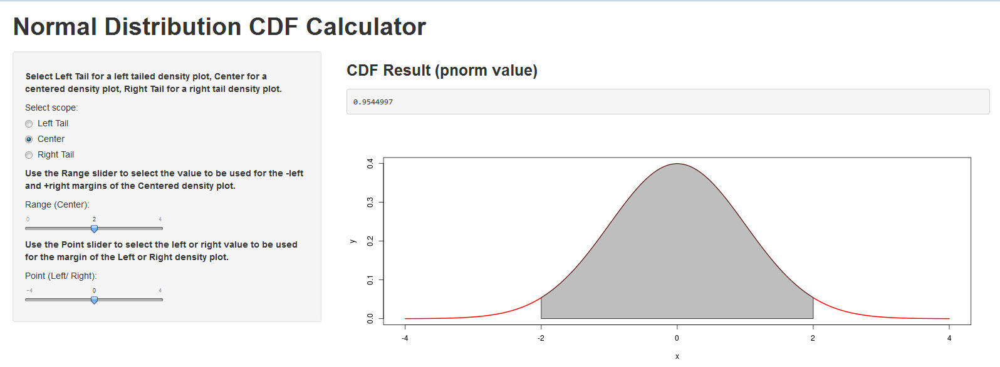
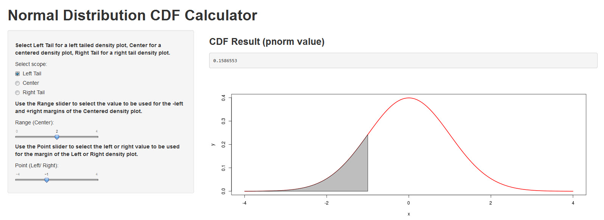
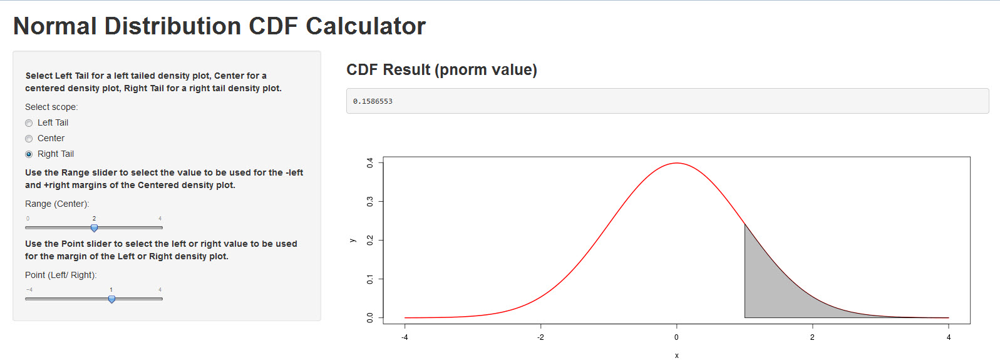

## Introduction

This product is written using one of the latest development tool Shiny.

This data product is really cool and useful. With it you can visualize left-tailed, centered, and right-tailed density plots and see the CDF value for the region being plotted. It is interactive and allows for varying the density and showing the probability associated with the selected value lying within the plotted region. The distribution has the domain of [-4,+4] and is normally distributed.

There are many such products on the market, however this one has one key advanctage - it is **free**!


---

## The Product
Below the default option is shown, a centered density plot.



---

## Other Options
Below you can see left-tailed and right-tailed density plots.




---

## The Code
The code is very simple - standard R code is embedded in the Shiny server and is executed reactively, i.e. as the user interface options are changed. 

Below you can see how the data behind the program is generated using the seq and dnorm commands.


```r
x=seq(-4,4,length=200)
y=dnorm(x)
str(x)
```

```
##  num [1:200] -4 -3.96 -3.92 -3.88 -3.84 ...
```

```r
str(y)
```

```
##  num [1:200] 0.000134 0.000157 0.000184 0.000215 0.000251 ...
```
